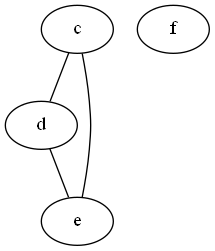

# The Fourth homework on the subject "Functional Logic and Theory of Algorithms"
## *Task condition (variant № 15):*
> Delete vertices adjacent to a given edge and 
> sort the remaining vertices in descending order of degree (sort by inserts)

### Project assembly:
The program is written in the Windows operating system, in the Dev-C++ application in the C programming language.


### Explanation of the algorithm of the code:

The user enters the number of vertices of the graph. 
Next, the program asks him for the edges between the vertices. 
If there is an edge between the vertices, then the user must enter "1", otherwise - "0".

```c
	printf("Enter the num verticles: ");
	scanf("%i", &size); 
	c = getchar();
	for (i; i < size; i++){ 
      		for (j; j < size; j++){ 
       			if ((i == j) && (size == 1)){ 
          			printf("Connect between  %i and %i: ", i + 97, j + 97); 
          			while ((c = getchar()) != '\n'){ 
               				mass[i][j] = c - '0'; 
               				mass[j][i] = c - '0'; 
          			}
        		}
        		else{ // иначе
           			printf("Connect between  %c and %c: ", i + 97, j + 97); 
            			while ((c = getchar()) != '\n'){ 
            				mass[i][j] = c - '0'; 
                			mass[j][i] = c - '0';
            			}
        		}
      		}
	u++; 
      	j = u; 
	}  
```

Next , a format file is created .dot for its further use in the graphical display of the graph we have introduced. 
After automatic generation, in the folder where our main.c is located, we will be able to see a graph in .png format.


After the operations performed, we make a request to delete vertices adjacent to the edge. 
The user enters the required edge in the form: "a-b". 
Then the process of removing vertices, generating a new .dot file and building a modified graph takes place.




The second subproblem consists in sorting the remaining vertices in descending order of their multiplicity by the insertion method. 
For implementation, we use the Insertion Sort function:

```c
	void InsertionSort(int mass [], int n){
		int i, j, temp;
		for (i = 0; i < n; i++){
    			temp = mass[i];
    			for (j = i - 1; j >= 0; j--){
        			if (mass[j] < temp)
            				break;
  				mass[j + 1] = mass[j];
        			mass[j] = temp;
    			}
		}
	} 
```

*Insertion sorting is a sorting algorithm in which the elements of the input sequence are viewed one by one, 
and each new incoming element is placed in a suitable place among the previously ordered elements.*


## What do we get in the end?
The program is working properly. 
It does not break when there are loops in the graph. Graphical display of graphs is debugged

### Launch the project: 
To start the project, you need to open the main.c file in the Dev-C++ application. 
Next, you need to click on the "Compile and execute" button or press F11

